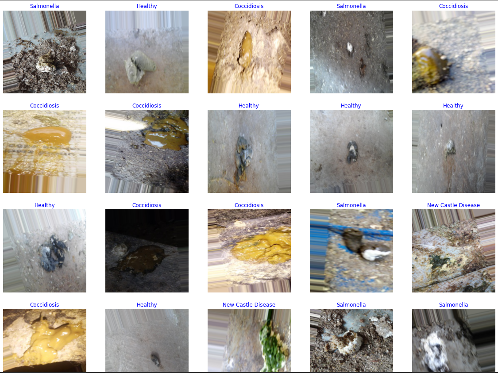

# Summary Project

Chicken is the most widely kept poultry in Indonesia, this is because chicken is one of the animal proteins that is widely consumed by the public (look for evidence). Most of the chickens consumed are from chicken breeders. One of the farms can accommodate hundreds or even thousands of chickens at once (search for data). With the large number of chickens available, it is difficult to distinguish between healthy and sick chickens. Therefore, a system is needed to find out sick and healthy chickens, as well as the type of chicken disease. This study tries to identify diseases in chickens based on chicken droppings, ranging from color, texture, and size.
the dataset link that we use can be accessed at the following link :

```
https://www.kaggle.com/datasets/allandclive/chicken-disease-1
```


## How did our team come up with this project?

We found that disease in chickens is quite difficult for farmers, because when a chicken is sick, other chickens have the potential to be infected with the same disease, so we propose a project that can recognize disease in chickens through chicken droppings. We are trying to combine machine learning, cloud computing, and mobile development in a disease classification project in chickens.

## Screenshots
an example of a dataset used regarding diseases in chickens that have been labeled

<!-- If you have screenshots you'd like to share, include them here. -->

Our Team Information
--
- (ML) Moh. Badris Sholeh Rahmatullah M2258G2238 
- (ML) Aulia Ligar Salma Hanani M2258G2240
- (CC) Steven Febrianto C2172F1707
- (CC) Dian Puspitasari C2214G1977
- (MD) Moch Yusuf Faisal Akbar Anwari A2121F1529
- (MD) Ilham Yori Pradana A2121F1534

## Setup

Clone this repository
```
git clone https://github.com/ilham-yori/ChickenDiseaseDetection.git
```

Change the current directory to the cloned git directory
```
cd ChickenDiseaseDetection
```

Create the python virtual environment
```
pip install virtualenv
virtualenv venv
```

Initialize virtual environment
#### Linux
```
source venv/bin/activate
```

#### Windows
```
.\venv\Scripts\activate
```

Install the dependencies requirement with pip
```
pip install -r requirements.txt
```

Run the app with Flask
```
flask run
```

Now, open http://127.0.0.1:5000/ on your browser
