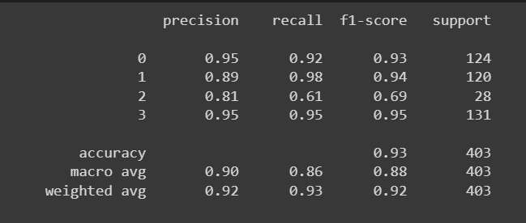
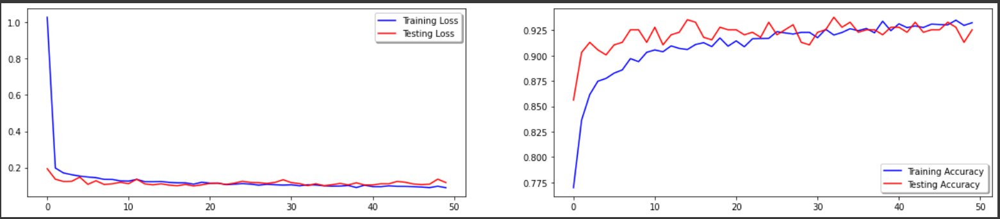
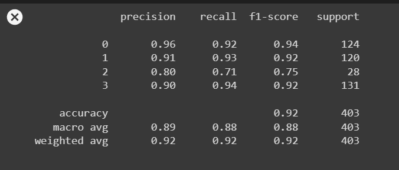
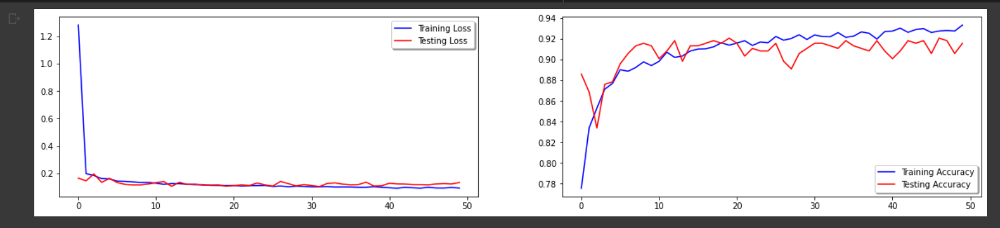
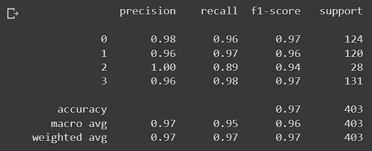
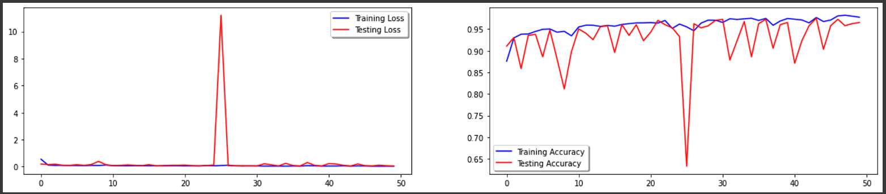

# Machine Learning Documentation
shared files follow this link. 
https://drive.google.com/drive/folders/1jGoohtw3-dMPfQM6iezK7rbz8S0uNiis?usp=sharing

Cleaning Dataset.
(https://drive.google.com/drive/folders/1UdrAKUTGDg7WzY7ehxapKRr73QpFrzw8?usp=sharing)

## VGG16

>  result of VGG16 Model

> accuracy and loss metric

<!-- If you have screenshots you'd like to share, include them here. -->

## VGG19

>  result of VGG19 Model

> accuracy and loss metric

<!-- If you have screenshots you'd like to share, include them here. -->

## ResNet

>  result of ResNet Model

> accuracy and loss metric

<!-- If you have screenshots you'd like to share, include them here. -->

## MobileNet

>  result of MobileNet Model

> accuracy and loss metric

<!-- If you have screenshots you'd like to share, include them here. -->
